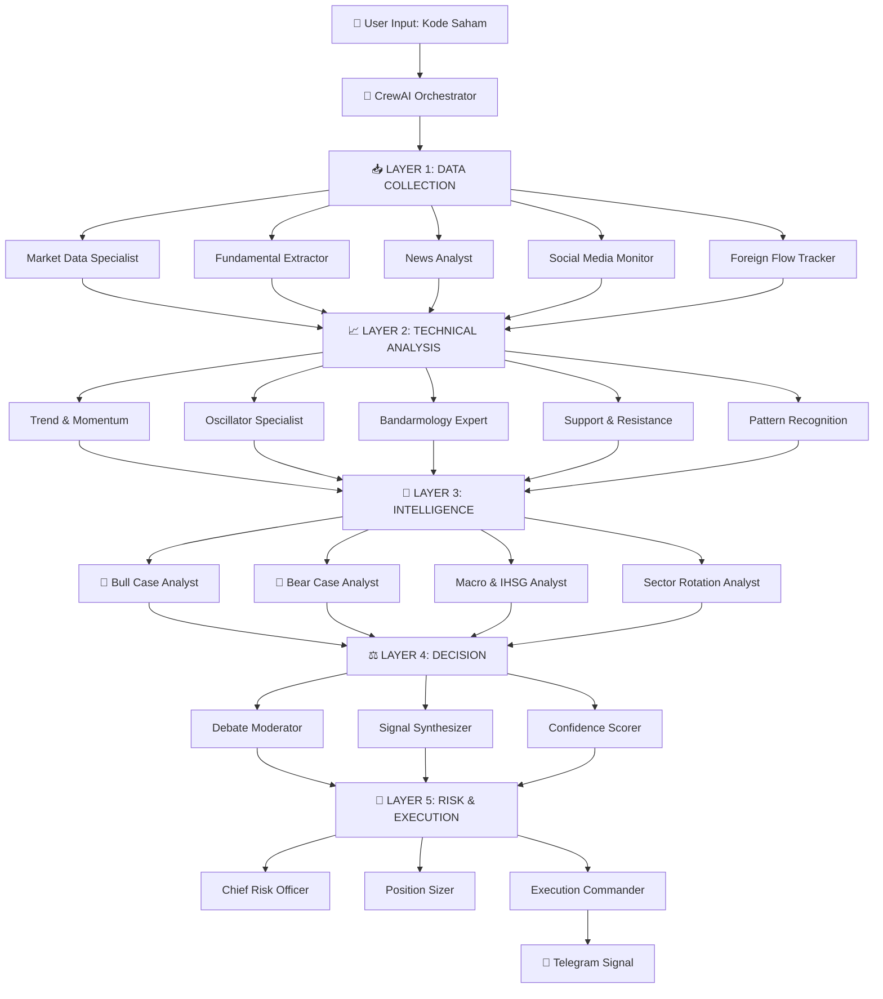

# 🤖 IDX AI Swing Trading Bot

> 20-Agent AI Trading System for Indonesian Stock Exchange (IDX) built with CrewAI


## 🎯 Overview

An advanced AI-powered trading analysis system that uses **20 specialized agents** working collaboratively to analyze IDX stocks and generate professional trading signals — complete with entry price, stop loss, take profit, and confidence score.

## 🏗️ Architecture


## ✨ Features

- **20 specialized AI agents** collaborating via CrewAI framework
- **Bull vs Bear debate** — agents argue both sides before final decision
- **Confidence scoring** — every signal comes with 0-100% confidence
- **Risk management** — automatic stop loss, take profit, position sizing
- **Telegram integration** — signals delivered directly to your phone
- **Real-time data** — live prices from Yahoo Finance
- **News sentiment analysis** — web search via Tavily API
- **Technical indicators** — RSI, MACD, MA, Stochastic, ADX, OBV, VWAP

## 📊 Sample Output
🤖 IDX SWING TRADING BOT
📊 SINYAL TRADING: BBCA
📌 SINYAL: BUY
💯 CONFIDENCE: 71%
💰 RENCANA TRADING:

Entry: Rp 5.820
Stop Loss: Rp 5.750
Target 1: Rp 5.925
Target 2: Rp 6.025
Lot: 28 lot
R/R Ratio: 2.9:1

📊 ANALISIS SINGKAT:
Harga BBCA sedang konsolidasi di atas support
psikologis Rp 5.800 dengan RSI dekat oversold (33,6)

## 🛠️ Tech Stack

- **Python 3.13**
- **CrewAI** — Multi-agent orchestration
- **LiteLLM** — Multi-LLM routing
- **Yahoo Finance (yfinance)** — Real-time stock data
- **Tavily** — Web search & news
- **Pandas & TA-Lib** — Technical analysis
- **Telegram Bot API** — Signal delivery

## 🚀 Getting Started

### 1. Clone repository
```bash
git clone https://github.com/Skylrks/idx-swingtrading-bot.git
cd idx-swingtrading-bot
```

### 2. Install dependencies
```bash
python -m venv venv
source venv/bin/activate
pip install -r requirements.txt
```

### 3. Setup environment variables
```bash
cp .env.example .env
# Fill in your API keys
```

### 4. Run
```bash
python main.py
```

## 🔑 Required API Keys

| Key | Source | Cost |
|-----|--------|------|
| `OPENROUTER_API_KEY` | openrouter.ai | Free tier available |
| `TAVILY_API_KEY` | tavily.com | Free tier available |
| `TELEGRAM_BOT_TOKEN` | @BotFather | Free |
| `TELEGRAM_CHAT_ID` | @userinfobot | Free |

## 🗺️ Roadmap

- [ ] Machine Learning price prediction (LSTM/XGBoost)
- [ ] Backtesting engine (5 years historical data)
- [ ] Multi-LLM routing (fast model for data, smart model for analysis)
- [ ] Self-learning from prediction mistakes
- [ ] Broker API integration for auto-execution
- [ ] Web dashboard

## ⚠️ Disclaimer

This project is for educational purposes only. Not financial advice. Always do your own research before investing.

## 👤 Author

**Skylrks** — Aspiring AI Agent Developer
- GitHub: [@Skylrks](https://github.com/Skylrks)